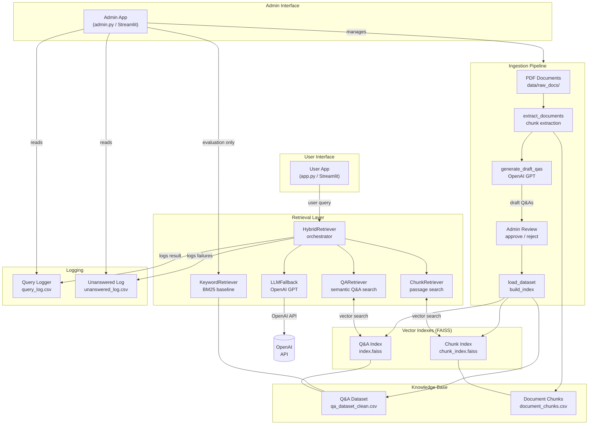
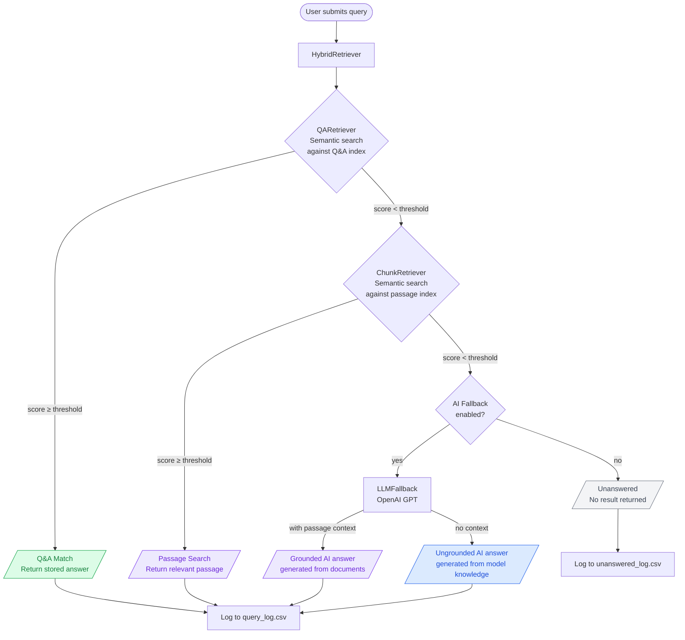
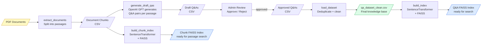

# Architecture Diagrams

Paste each diagram into https://mermaid.live to render and export as PNG/SVG.

---

## Diagram 1: System Component Architecture

---

## Diagram 2: Query Flow (Runtime Sequence)

---

## Diagram 3: Ingestion Pipeline

---

## How to Export

1. Go to **https://mermaid.live**
2. Paste one diagram block (the content between the triple backticks)
3. Click **Export → PNG** or **Export → SVG**
4. SVG is better for print/PDF dissertations — scales without pixelation

## Tips for Your Dissertation

- **Diagram 1** goes in the **System Architecture** section of your implementation chapter — gives the examiner the full picture
- **Diagram 2** goes in the **Retrieval Design** section — shows you understand the runtime behaviour and the layered fallback logic
- **Diagram 3** goes in the **Knowledge Base Construction** section — illustrates the ingestion methodology
- Label figures consistently: *Figure 1: System Component Architecture*, etc.
- Reference each diagram in your text — don't just drop them in without explanation
